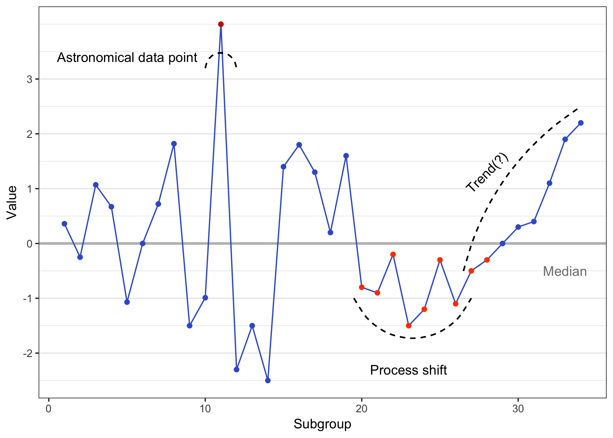
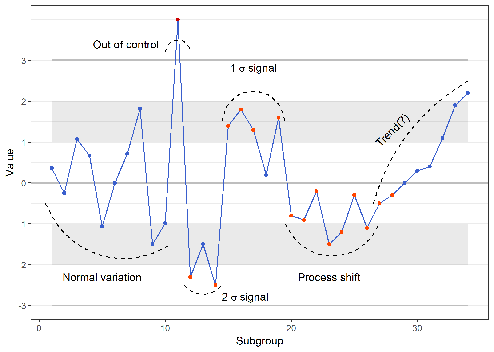

# Guidelines for interpreting SPC charts {#guidelines}

``` {r sgnlex, echo = FALSE}

# Example points for signal rules of thumb
point.signal = c(0.36, -0.25, 1.07, 0.67, -1.07, 0, 0.72, 1.82, -1.50, -0.99)
point.signal[11] = 4.0 # SCREW WITH THIS VALUE
point.signal[12:14] = c(-2.3, -1.5, -2.5)
point.signal[15:19] = c(1.4, 1.8, 1.3, 0.2, 1.6)
point.signal[20:27] = c(-0.8, -0.9, -0.2, -1.5, -1.2, -0.3, -1.1, -.5)
point.signal[28:34] = c(-.3, 0, 0.3, 0.4, 1.1, 1.9, 2.2)

subgroup.signal = 1:34
mean.signal = 0
median.signal = median(point.signal)
sigma.signal = rep(1,34)

sig1 = as.character(expression(1~sigma~signal))
sig2 = as.character(expression(2~sigma~signal))

example_cc = spc.plot(subgroup.signal, point.signal, mean.signal, sigma.signal) +
    geom_curve(x = 0.5, xend = 10.5, y = -0.5, yend = -1.5, linetype = 2) +
    annotate('text', x = 5, y = -2.3, label = 'Normal variation') +
    geom_curve(x = 10, xend = 12, y = 3.2, yend = 3.2, curvature = -1, linetype = 2) +
    annotate('text', x = 9.5, y = 3.4, label = 'Out of control', hjust = 1) +
    geom_curve(x = 11.5, xend = 14.5, y = -2.5, yend = -2.5, linetype = 2) +
    annotate('text', x = 14.5, y = -2.8, parse = TRUE, label = sig2, hjust = 0) +
    geom_curve(x = 14.5, xend = 19.5, y = 1.5, yend = 1.5, curvature = -1, linetype = 2) +
    annotate('text', x = 17, y = 2.8, parse = TRUE, label = sig1) +
    geom_curve(x = 19.5, xend = 27, y = -1, yend = -1, curvature = 0.7, linetype = 2) +
    annotate('text', x = 23, y = -2.3, label = 'Process shift') +
    geom_curve(x = 26.5, xend = 34, y = -0.5, yend = 2.5, curvature = -0.2, linetype = 2) +
    annotate('text', x = 28, y = 1.3, label = 'Trend(?)', angle = 45) +
    theme(panel.grid.major.x = element_blank(), panel.grid.minor.x = element_blank()) +
    scale_y_continuous(breaks = seq(-3,3))

ggsave("images/example_control_chart.png")

# Do we want to make the y-axes the same range and line up?

example_rc = spc.plot(subgroup.signal, point.signal, median.signal, sigma.signal, band.show = FALSE, ucl.show = FALSE, lcl.show = FALSE) +
    geom_curve(x = 10, xend = 12, y = 3.2, yend = 3.2, curvature = -1, linetype = 2) +
    annotate('text', x = 9.5, y = 3.4, label = 'Astronomical data point', hjust = 1) +
    geom_curve(x = 19.5, xend = 27, y = -1, yend = -1, curvature = 0.7, linetype = 2) +
    annotate('text', x = 23, y = -2.3, label = 'Process shift') +
    geom_curve(x = 26.5, xend = 34, y = -0.5, yend = 2.5, curvature = -0.2, linetype = 2) +
    annotate('text', x = 28, y = 1.3, label = 'Trend(?)', angle = 45) +
    annotate('text', x= 33, y = -0.5, label = "Median", color = "gray50") +
    theme(panel.grid.major.x = element_blank(), panel.grid.minor.x = element_blank()) +
    scale_y_continuous(breaks = seq(-3,3))

ggsave("images/example_run_chart.png")
```

| Run chart | Control Chart |
| ----------------------------------- | ------------------------------------- |
|  |  |
| **Identifying possible signals of change in run charts** | **Detecting special cause variation in control charts** |
|  |  | 
| *"Astronomical" data point:* a point so different from the rest that anyone would agree that the value is unusual. | *One or more points fall outside the control limit:* if the data are distributed according to the given control chart's assumptions, the probability of seeing a point outside the control limits when the process has not changed is very low. |
|  |  | 
| *Process shift:* $log_2(n) + 3$ data points are all above or all below the median line, where $n$ is the total number of points that do $not$ fall directly on the median line. | *Process shift:* $log_2(n) + 3$ data points are all above or all below the mean line, where $n$ is the total number of points that do $not$ fall directly on the mean(?) line. |
|  |  | 
| *Number of crossings:* Too many or too few median line crossings suggest a pattern inconsistent with natural variation [see Chapter 6.1](#runcharts). | *Number of crossings:* Too many or too few center line crossings suggest a pattern inconsistent with natural variation ([see Chapter 6.1](#runcharts)). | 
|  |  | 
| *Trend:* Seven or more consecutive points all increasing or all decreasing (though this can be an ineffective indicator\*). | *Trend:* Seven or more consecutive points all increasing or all decreasing (though this can be an ineffective indicator\*).  | 
|  |  | 
| *Cycles:* There are obvious cycles that are not linked to known causes such as seasonality. | *Cycles:* There are obvious cycles of any sort. | 
|  |  | 
| | *Reduced variation:* Fifteen or more consecutive points all within 1$\sigma$. | 
|  |  | 
| | *1$\sigma$ signal:* Four of five consecutive points are more than one standard deviation away from the mean. | 
|  |  | 
| | *2$\sigma$ signal:* Two of three consecutive points are more than two standard deviations away from the mean. |

\**Note: Although many people use a "trend" test in association with run and control charts, research has shown this test to be ineffective (see [Useful References](#useful)).* 
