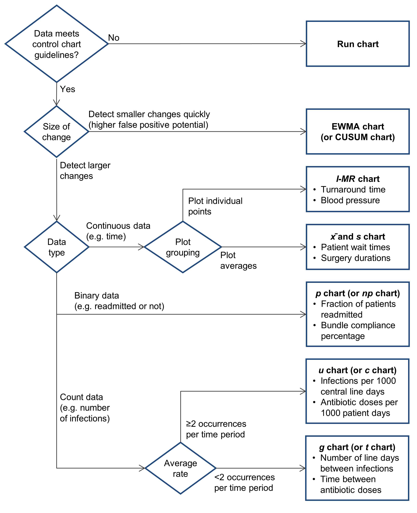

# Control charts {#controlcharts}

## Natural variation and control charts

Statistical theory provides the basis by which we can evaluate processes to more confidently detect changes in process amongst the noise of natural variation.   

Understanding natural variation in time series or sequential data is the essential point of quality assurance or process improvement efforts. It's a rookie mistake to use control charts to focus solely on the values themselves or their central tendency. You need to look at all of the elements of a control chart to understand what it's telling you.    

This graph shows a process created using random numbers based on a known normal distribution, where the overall distribution is shown in a histogram to the right of the run chart.  

```{r ggmarg, fig.height=4}
set.seed(250)
df = data.frame(x = seq(1:120), y = 18+rnorm(120))

nat_var_run_plot = ggplot(df, aes(x, y)) + 
  ylim(14.75, 21.25) +
  geom_hline(aes(yintercept=18), color="gray", size=1) +
  xlab("Subgroup") + 
  ylab("Value") +
  geom_line() + 
  theme_bw()

ggMarginal(nat_var_run_plot, margins="y", type = "histogram", binwidth=0.5)
```


The next plot shows control limits and 1-2$\sigma$ bands for comparison. Note that some of the control chart guidelines for detecting special causes suggest that some special cause variation has occurred in this data. Since this data was generated using random numbers from a known normal distribution, these are false positives. It's important to remember that control charts are meant to balance true and false negatives, but can never entirely eliminate either.    

```{r ggmarg_cc, fig.height=4}
nat_var_cc_plot = ggplot(df, aes(x, y)) + 
  ylim(14.75, 21.25) +
  geom_hline(aes(yintercept=18), color="gray", size=1) +
  geom_hline(aes(yintercept=20.96), color="red") +
  geom_hline(aes(yintercept=15.1), color="red") +
  geom_ribbon(aes(ymin = 18.98, ymax = 19.96), alpha = 0.2) +
  geom_ribbon(aes(ymin = 16.04, ymax = 17.02), alpha = 0.2) +
  xlab("Subgroup") + 
  ylab("Value") +
  geom_line() + 
  theme_bw()

ggMarginal(nat_var_cc_plot, margins="y", type = "histogram", binwidth=0.5)
```


## Which control chart should I use? {#whichcontrolchart}

The following flow chart can help you determine which kind of control chart you might want to use. More details and formulas for each control chart type are provided in the [Control Chart Creation Details] section.   




## When to revise control limits

If you need to determine whether an intervention might have worked soon after or even during the improvement process, you shouldn't be using a standard control chart at all. Use a run chart or an EWMA or CUSUM chart to try to detect early shifts.

When you have enough data points after the intervention (about 12-20), with no other changes to the process, you can "freeze" the median, and/or mean+control limits at the intervention point and recalculate the median and/or mean+limits on the subsequent data. However, by doing so you are *already assuming* that the intervention changed the process. Sometimes that evidence will be there, such as through a variety of signals of special cause variation; other times, that evidence will not be there. If there is no evidence of special cause variation for a while after the intervention, you shouldn't freeze/restart the SPC chart values. 

SPC charts are blunt instruments, and are meant to detect obvious *step* changes in a process as simply as possible. Where there is no evidence in SPC charts for a change, more advanced techniques---such as ARIMA models or intervention/changepoint analysis---can be used to assess whether there was a change in the statistical process at or near the intervention point.  

Use common sense and avoid the urge to change medians or means+limits for every intervention unless evidence is clear that it worked.   


## Tips and tricks for successful control chart use

- The definition of your control limits depends on the trade-off between sensitivity and specificity for the question at hand. Typical control charts are built on 3$\sigma$ limits, which provides the optimal trade-off between sensitivity and specificity, that is, between under- and over-alerting to an indication of special cause variation. When you need to err on the side of caution---for example, in patient safety applications---2$\sigma$ limits may be more appropriate, while understanding that false positives will be higher. If you need to err on the side of certainty, 4-6$\sigma$ limits may be more useful.  

- With fewer than 20 observations, there is an increased chance of missing special cause variation. With more than 30 observations, there's an increased chance of detecting special cause variation that is really just chance. Knowing these outcomes are possible is useful to help facilitate careful thinking when control charts indicate special cause variation.     

- Ensure your data values and control limits make sense. For example, if you have proportion data and your control limits fall above 100 or below 0, there's clearly an error somewhere. Ditto with negative counts.  

- For raw ordinal data (such as likert scores), do not use means or control limits. Just. Don't. If you must plot a single value, convert to a proportion (e.g., "top box scores") first. However, stacked bar or mosaic charts help visualize this kind of data much better, and can be done in the same amount of space.    

- Control charts don't measure "statistical significance"---they are meant to reduce the chances of incorrectly deciding whether a process is in (statistical) control or not. Control limits are *not* confidence limits.     

- YTD comparisons don't work because they encourage naive, point-to-point comparisons and ignore natural variation---and can encourage inappropriate knee-jerk reactions. There is never useful information about a process in only one or two data points.  

- A control chart should measure one defined process, so you may need to create multiple charts stratified by patient population, unit, medical service, time of day etc. to avoid mixture.   

- With very large sample or subgroup sizes, control limits will be too small, and the false positive rate will skyrocket. Use prime charts instead.     
