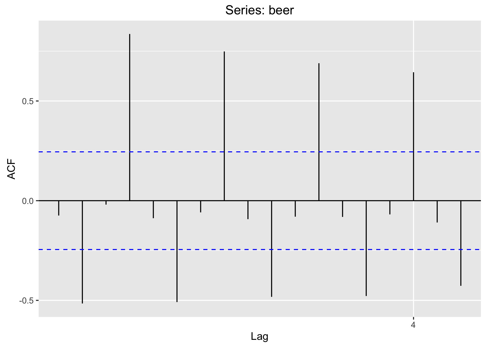
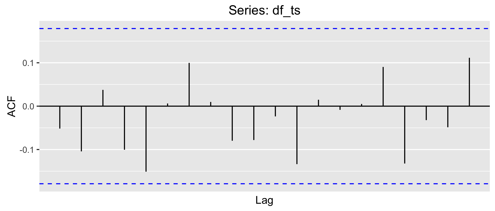

# More stuff


## Time series exploration

There is usually far more information in a time series than is typically explored with basic SPC methods. You can create a variety of exploratory and diagnostic plots that help you understand the data more thoroughly.  

### Seasonplot
```{r seasonplot, fig.height=3}
ggseasonplot(df_ts)
```

### Monthplot
```{r monthplot, fig.height=3}
ggmonthplot(df_ts)
```


### Autocorrelation
```{r acf, fig.height=3}
# acf plot using the autoplot function instead of base
autoplot(acf(df_ts, plot = FALSE))
```

```{r lagplot}
# Scatterplot of autocorrelation through first 12 lags
lag.plot(df_ts, lags = 12, do.lines = FALSE)
```

### Cycles
```{r periodicity, fig.height=3}
TSA::periodogram(df_ts)
```

### Decomposition
```{r decomp}
autoplot(decompose(df_ts))
```

### Overall trend (if any)
```{r loess_trend, fig.height=3}
autoplot(df_ts) + 
  geom_smooth()
```

### Seasonal adjustment
```{r seasonal, fig.height=3}
# Convert ts to data frame
df_ts_df = tsdf(df_ts)

# Plot original qnd seasonally adjusted data
ggplot(df_ts_df, aes(x, y)) + 
  geom_line() +
  stat_seas(color="blue")
```

### Residuals 
```{r residuals}
# Convert ts residuals to data frame
df_ts_df_rand = tsdf(decompose(df_ts)$random)

# Add month as a factor
df_ts_df_rand$mnth = factor(rep(month.abb, 10), levels = month.abb)

# Plot residuals
# No apparent patterns
ggplot(df_ts_df_rand, aes(x, y)) + 
  geom_hline(yintercept = 0, linetype = "dotted") +
  geom_smooth(color = "gray70", alpha = 0.2) +
  geom_point(aes(color = mnth))
```

```{r residuals_faceted}
# Residuals faceted by month
# Is December weird? Rest seem ok
ggplot(df_ts_df_rand, aes(x, y)) + 
  geom_hline(yintercept = 0, linetype = "dotted") +
  geom_smooth(color = "gray70", alpha = 0.2) +
  facet_wrap(~ mnth) +
  geom_point(aes(color = mnth))
```


## What does it look like when there are time-dependent patterns? {#timedep}

Compare the results above, where there were no time-dependent patterns, to those here, where there is clear quarterly seasonality, with a declining trend in the fourth quarter over the time period.   


```{r patterns, fig.height=3}
# Use Australian beer data
data(ausbeer, package = "fpp")
beer = window(ausbeer, start = 1990.00, end = 2005.75)

# Summary plots: data, autocorrelation, and spectral density
ggtsdisplay(beer, plot.type = "spectrum")

# Scatterplot of autocorrelation through first 8 lags
lag.plot(beer, lags = 8, layout = c(2, 4), do.lines = FALSE)

###
# USE THESE SIDE BY SIDE?
p1 = autoplot(acf(mb_ts, plot = FALSE)) 
ggsave("images/ac.png") 

p2 = autoplot(acf(df_ts, plot = FALSE))
ggsave("images/no_ac.png")
###

# Full periodogram
TSA::periodogram(beer)

# Decomposition
autoplot(decompose(beer))

# Seasonplot
ggseasonplot(beer)

# Monthplot
ggmonthplot(beer)

# Convert ts to data frame
df_ts_df_rand = tsdf(decompose(beer)$random)
df_ts_df_rand$qtr = factor(quarter(date_decimal(df_ts_df_rand$x)))

# Plot original qnd seasonally adjusted data
ggplot(df_ts_df_rand, aes(x, y)) + 
  geom_line() +
  stat_seas(color="blue")

# All together residuals
ggplot(df_ts_df_rand, aes(x, y)) + 
  geom_hline(yintercept=0, linetype="dotted") +
  geom_smooth(color = "gray70", alpha = 0.2) +
  geom_point(aes(color = qtr)) +
  scale_color_manual(values=c("#E69F00", "#56B4E9", "#009E73", "#000000"))

# Residuals faceted by quarter
ggplot(df_ts_df_rand, aes(x, y)) + 
  geom_hline(yintercept=0, linetype="dotted") +
  geom_smooth(color = "gray70", alpha = 0.2) +
  facet_wrap(~ qtr) +
  geom_point(aes(color = qtr)) +
  scale_color_manual(values=c("#E69F00", "#56B4E9", "#009E73", "#000000"))
```


## More on autocorrelation

| Example autocorrelated data | Example non-autocorrelated data |
| ----------------------------------- | ------------------------------------- |
|  |  |

When data are autocorrelated, control limits will be *too small*---and thus an increase in *false* signals of special causes should be expected. In addition, none of the tests for special cause variation remain valid.    

Sometimes, autocorrelation can be removed by changing the sampling or metric's time step: for example, you generally wouldn't expect hospital acquired infection rates in one quarter to influence those in the subsequent quarter. It can also be sometimes removed or abated with differencing, although doing so hurts interpretability of the resulting run or control chart. 

```{r diffing, fig.height=3}
# Take the fourth lag to difference the beer data
beer_diff = diff(beer, lag = 4)

# Plot the resulting autocorrelation function
autoplot(acf(beer_diff, plot = FALSE))
```

If have autocorrelated data, and you aren't willing to difference the data or can't change the sampling rate or time step, you shouldn't use either run or control charts, and instead use a standard line chart. If you must have limits to help guide decision-making, you'll need a more advanced technique, such as a Generalized Additive Mixed Model (GAMM) or time series models such as ARIMA. It's probably best to work with a statistician if you need to do this.   


## Prime charts


## GAM {#GAM}

*Stuff based on Morton et al. book here*  


## OC Curves


## Pareto charts


